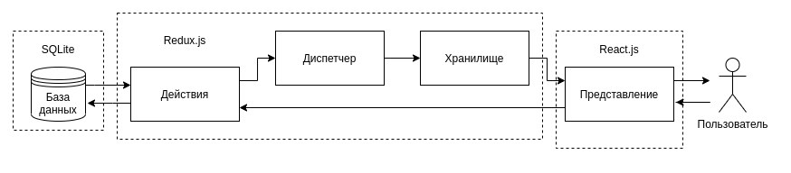
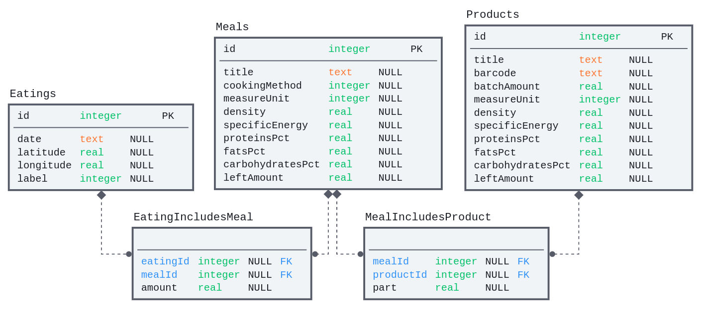

# Мобильное приложение для упрощение подсчета и журналирования количества потребленных калорий и отслеживания продуктов в холодильнике «Нееш»

### Экраны приложения

1. Экран приветствия `OnboardingScreen`
    1. Вкладки с информацией о возможностях приложения
2. Экран настроек `SettingsScreen`
    1. Поле ввода имени
    2. Слайдер установки цели в ккал
    3. Переключатель сохранения геолокации
    4. Кнопка «Сохранить»
2. Экран ленты | профиля `FeedScreen`
    1. Информация о потреблении ккал за последние сутки
    2. Актуальная рекомендация
    3. Кнопка «Приготовить блюдо»
    4. Кнопка «Сканировать код»
    5. Список приемов пищи, для каждого доступна информация:
        1. Дата и время
        2. Ярлык
        3. Общее количество ккал
        4. Список блюд и их количеств
        5. Общая масса
        6. Общая масса белков
        7. Общая масса жиров
        8. Общая масса углеводов
3. Экран сканера `ScannerScreen`
    1. Окошко сканера с видоискателем
4. Экран холодильника | «Моя еда» `FrigdeScreen`
    1. Кнопка «Добавить продукт»
    2. Кнопка «Добавить рецепт»
    3. Список из известных блюд, сначала те, которые есть в наличии
5. Экран текущего приема пищи | «Тарелка» `PlateScreen`
    1. Список блюд в тарелке, для каждого:
        1. Название
        2. Количество
        3. Количество ккал
        4. Кнопка «Убрать»
        5. Кнопка «Подробнее»
    2. Сумма ккал
    3. Кнопка «Съесть»
6. Экран добавления продукта `AddNewProductScreen`
    1. Поле ввода штрихкода
    2. Поле ввода названия
    3. Выбор единиц измерения
    4. Поле ввода объема упаковки
    5. Поля ввода пищевой ценности на 100 г:
        1. ккал
        2. белки
        3. жиры
        4. углеводы
    6. Кнопка «Добавить»
7. Экран добавления рецепта `AddNewRecipeScreen`
    1. Поле ввода названия
    2. Выбор способа приготовления
    3. Список добавленных продуктов, для каждого:
        1. Название
        2. Поле ввода количества
        3. Кнопка «Убрать»
    4. Кнопка «Добавить»
    5. Итоговая калорийность на 100 г
    6. Кнопка «Добавить»
8. Экран информации о продукте `ProductViewScreen`
    1. Штрихкод
    2. Название
    3. Размер упаковки
    4. Наличие в холодильнике
    5. Наличие в тарелке
    6. Пищевая ценность на 100 г:
        1. ккал
        2. белки
        3. жиры
        4. углеводы
    7. Кнопки выбора действия:
        1. «Выборосить»
        2. «Приобрести»
        3. «Наложить»
    8. Поле ввода количества
    9. Кнопка подтверждения, соответствующая выбранному действию
9. Экран информации о блюде `MealViewScreen`
    1. Название
    2. Наличие в холодильнике
    3. Наличие в тарелке
    4. Пищевая ценность на 100 г:
        1. ккал
        2. белки
        3. жиры
        4. углеводы
    5. Список продуктов в составе, дла каждого:
        1. Название
        2. Массовая доля в процентах
    6. Кнопки выбора действия:
        1. «Выборосить»
        2. «Приготовить»
        3. «Наложить»
    8. Поле ввода количества
    9. Кнопка подтверждения, соответствующая выбранному действию
10. Экран выбора продукта `SelectProductScreen`
    1. Список известных продуктов, для каждого:
        1. Название
        2. Количество в холодильнике
        3. Кнопка «Выбрать»
11. Экран выбора блюда `SelectMealScreen`
    1. Список известных блюд, для каждого:
        1. Название
        2. Количество в холодильнике
        3. Кнопка «Выбрать»
12. Экран приготовления блюда `CookingScreen`
    1. Название текущего блюда
    2. Метод приготовления
    3. Поле ввода желаемой итоговой массы
    4. Список ингридиентов, для каждого:
        1. Название
        2. Необходимая масса
        3. Чекбокс
    5. Кнопка «Готово»

### Архитектура приложения (потоки данных)

### Таблицы базы данных

1. Приемы пищи
    1. ID
    2. Дата и время
    3. Широта
    4. Долгота
    5. Ярлык
2. Блюда
    1. ID
    2. Название
    3. Метод приготовления
    4. Единицa измерения
    5. Плотность
    6. Калорий на 1 г
    7. Массовая доля белков
    8. Массовая доля жиров
    9. Массовая доля углеводов
    10. Оставшееся количество в холодильнике
3. Связь: Приемы пищи—Блюда
    1. ID Приема пищи
    2. ID Блюда
    3. Количество блюда
4. Продукты
    1. ID
    2. Название
    3. Штрих-код
    4. Количество в упаковке
    5. Единицa измерения
    6. Плотность
    7. Калорий на 100 г
    8. Массовая доля белков
    9. Массовая доля жиров
    10. Массовая доля углеводов
    11. Оставшееся количество в холодильнике
5. Связь: Блюда—Продукты
    1. ID Блюда
    2. ID Продукта
    3. Массовая доля продукта
